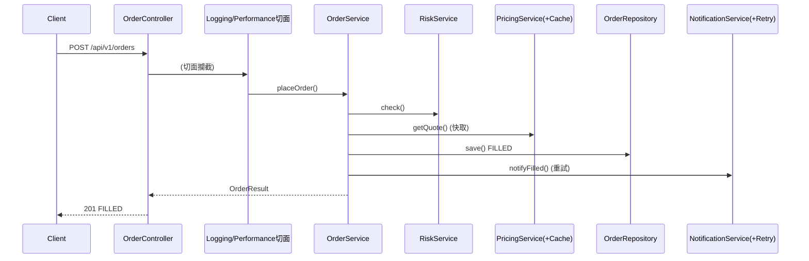
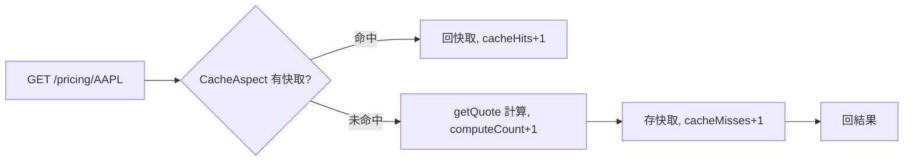
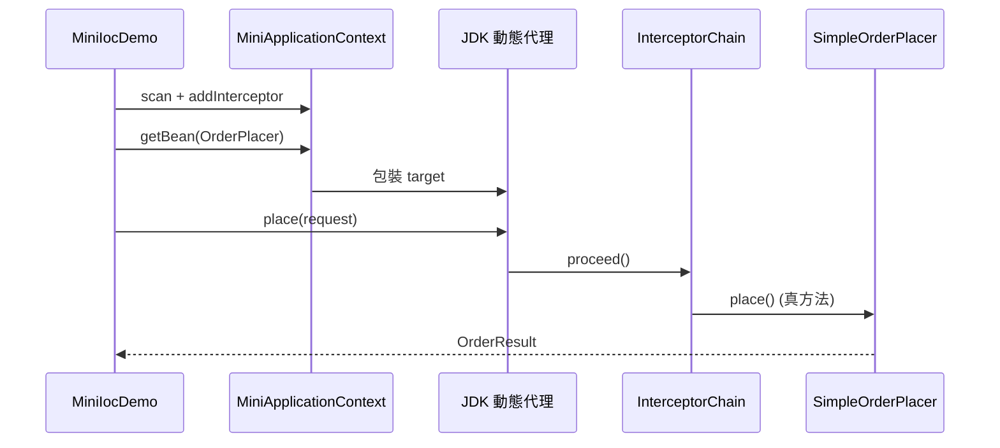

# TradingIocAOP — 功能流程說明

> 對齊 `開發專案規格書.md`。每個功能：做什麼 / 程式步驟 / 流程圖。

---

## 1. 下單（trading-app 主路徑）

### 做什麼

收下單請求，經風控、報價、落庫、通知，回傳成交結果。過程中六大 AOP 切面同步運作。

### 程式步驟

| 步驟 | 類別 | 說明 |
|------|------|------|
| 1 | `OrderController.place()` | 收 JSON，`@Valid` 驗證 `PlaceOrderRequest` |
| 2 | `OrderService.placeOrder()` | 編排入口（被 Logging/Performance 切面包住） |
| 3 | `RiskService.check()` | 風控；不過拋 `RiskRejectedException`（被 ExceptionAspect 記錄） |
| 4 | `PricingService.getQuote()` | 報價（`@Cacheable` → CacheAspect） |
| 5 | `OrderRepository.save()` | 落庫，狀態 FILLED |
| 6 | `NotificationService.notifyFilled()` | 通知（`@Retryable` → RetryAspect） |
| 7 | `AuditAspect.audit()` | `@AfterReturning` 寫稽核軌跡 |

### 流程圖

### 為什麼通知失敗不讓下單失敗？

通知屬「非關鍵副作用」。RetryAspect 會先自動重試；即便最終仍失敗，`OrderService` 以 try/catch 吞下並在訊息註記，確保成交結果不被通知通道拖累。

---

## 2. 報價查詢（示範快取切面）

### 做什麼

回傳指定 symbol 的報價；相同 symbol 第二次起直接回快取。

### 程式步驟

| 步驟 | 類別 | 說明 |
|------|------|------|
| 1 | `PricingController.quote()` | 收 symbol |
| 2 | `CacheAspect.aroundCacheable()` | 查快取；命中即回，未命中往下 |
| 3 | `PricingService.getQuote()` | 計算報價，`computeCount++` |

### 流程圖

---

## 3. 手刻容器示範（mini-ioc）

### 做什麼

用手刻的 `MiniApplicationContext` 掃描元件、建構子注入、套上攔截器代理，執行迷你下單。

### 程式步驟

| 步驟 | 類別 | 說明 |
|------|------|------|
| 1 | `MiniApplicationContext.scan()` | `ClasspathScanner` 找出 `@Component` |
| 2 | `getBean(OrderPlacer.class)` | 解析 `SimpleOrderPlacer` 建構子相依（RiskChecker/PricingGateway） |
| 3 | `ProxyFactory.createProxy()` | 對有介面的元件套 JDK 動態代理 |
| 4 | `InterceptorChain.proceed()` | 依序跑 Logging/Timing 攔截器，最後呼叫真方法 |

### 流程圖

---

*最後更新：2026-07-07*
